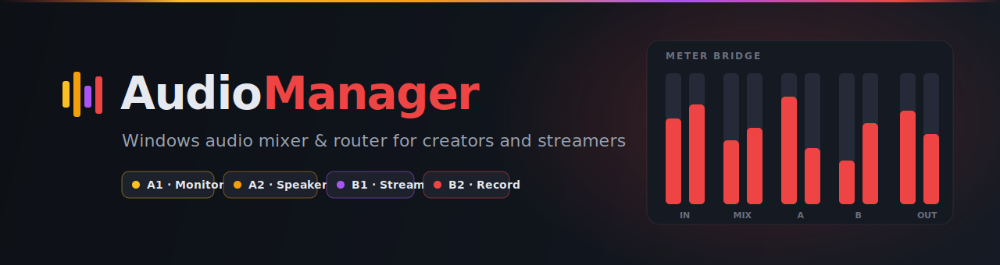
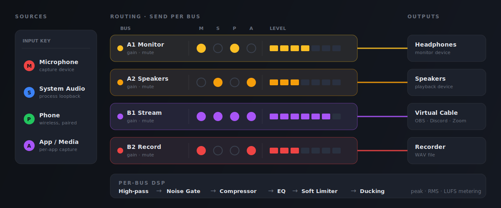

<div align="center">



<br>

[](https://github.com/Sdomit/AudioManager/actions/workflows/ci.yml)


<p>
  <b>Route any audio input to any output bus.</b> Per-input and per-send gain, real-time metering,<br>
  per-bus DSP, and preset snapshots. Built for streaming, podcasting, and complex routing.
</p>

<a href="#features">Features</a> ·
<a href="#signal-flow">Signal Flow</a> ·
<a href="#getting-started">Getting Started</a> ·
<a href="#virtual-stream-output">Streaming</a> ·
<a href="#documentation">Docs</a>

</div>

---

## Features

| Capability | What it does |
| --- | --- |
| **4 fixed output buses** | `A1` `A2` `B1` (Stream) `B2`, each with volume, mute, enable, and live metering |
| **Routing matrix** | Send any input to any combination of buses, independently |
| **Per-input controls** | Master gain and mute for each capture device |
| **Per-send controls** | Volume, mute, and enable on every input to bus connection |
| **Per-bus DSP** | High-pass, noise gate, compressor, EQ, soft limiter, ducking |
| **Advanced metering** | Peak, RMS, LUFS, and clip detection |
| **Per-bus output routing** | Assign each bus to any playback device |
| **Preset snapshots** | Save and load full routing configs (V2 format, V1 migration) |
| **Wireless phone input** | Pair a phone over Wi-Fi and use it as a routable mixer input |
| **B1 stream output** | Built-in guidance for virtual cable routing to OBS, Discord, Zoom |

## Coming Soon

| Feature | Description |
| --- | --- |
| **Phone remote control** | Mute, adjust gain, and toggle effects on the desktop mixer directly from the paired phone's browser — no app install required |
| **Live sound gate — stream buses** | Per-input noise gate exposed as a one-click control on stream buses, pre-tuned for voice; threshold, attack, hold, and release adjustable without leaving the routing view |
| **Live sound gate — phone inputs** | Same gate applied per wireless phone input — silences the room between sentences so background noise never bleeds into the stream |
| **Multi-phone proximity gating** | When multiple phones are connected in the same room, each phone's gate listens for the loudest nearby voice and opens only for it. If two phones pick up the same person, the quieter input is suppressed automatically — eliminating echo, phasing, and duplicate audio on the mix. Each participant is captured by the phone closest to them; everyone else is gated out. |

## Signal Flow

Inputs pass through the routing matrix into four buses. Each bus runs its own DSP chain and metering, then drives an output device, a virtual cable, or a file.

<div align="center">
  
</div>

## Architecture

| Layer | Stack |
| --- | --- |
| **Frontend** | React + TypeScript + Vite |
| **Desktop shell** | Tauri 2 |
| **Audio backend** | Rust with CPAL and WASAPI for low-latency capture and playback |
| **Storage** | JSON presets stored locally |

For the full design and audio pipeline, see [ARCHITECTURE.md](docs/ARCHITECTURE.md).

## Getting Started

**Prerequisites:** Windows 10+, Node.js 18+ with pnpm, Rust 1.70+.

```bash
# Install dependencies
pnpm install

# Dev mode (live reload)
pnpm tauri dev

# Build for release
pnpm build tauri

# Run tests
cargo test --manifest-path src-tauri/Cargo.toml
```

For detailed setup, see [SETUP.md](docs/SETUP.md).

## Virtual Stream Output

Use **B1** (Stream Output) with a virtual audio cable to send audio into OBS, Discord, Zoom, or any app.

1. Install a virtual audio cable ([VB-Cable](https://vb-audio.com/Cable/) or [Virtual Audio Cable](https://virtualaudiocable.org/))
2. Assign **B1** to the cable's playback device (usually **CABLE Input**)
3. In your streaming app, select the matching recording device (usually **CABLE Output**)
4. Route audio to B1 in the input matrix
5. Start streaming

> **Naming gotcha:** the AudioManager playback side (CABLE Input) is the recording side in OBS/Discord.

For setup and troubleshooting, see [STREAMING_SETUP.md](docs/STREAMING_SETUP.md).

## Smoke Test Checklist

After launching the app:

- [ ] App opens without errors
- [ ] A1, A2, B1, B2 buses are visible
- [ ] Assign A1 and B1 to output devices
- [ ] Add a microphone input
- [ ] Enable microphone to A1 and to B1
- [ ] A1 and B1 show "running" status
- [ ] Microphone meter moves when speaking, bus meter updates
- [ ] Send volume sliders and bus mute work
- [ ] Clip indicator appears when loud
- [ ] Preset save / load / delete works
- [ ] No console errors

## Safety Notes

> ⚠️ **Always use headphones during testing to prevent feedback loops.**

- Keep input volume below 50% when testing a microphone near speakers
- B1 stream output does not play on your computer, it only routes to the virtual cable
- Audio routes exactly as configured: input to B1 with B1 assigned to speakers will feed back

## Known Limitations

- No custom virtual audio driver (uses external virtual cable devices)
- No ASIO support (uses WASAPI)
- No sample-rate conversion (device sample rates must match)
- Windows first (macOS / Linux untested)

## Documentation

| Doc | Contents |
| --- | --- |
| [ARCHITECTURE.md](docs/ARCHITECTURE.md) | Technical design and audio pipeline |
| [SETUP.md](docs/SETUP.md) | Installation and development |
| [STREAMING_SETUP.md](docs/STREAMING_SETUP.md) | Virtual cable workflow |
| [TROUBLESHOOTING.md](docs/TROUBLESHOOTING.md) | Common issues and solutions |
| [ROADMAP.md](docs/ROADMAP.md) | Planned features and phases |
| [DEVELOPMENT.md](docs/DEVELOPMENT.md) | Dev environment setup |
| [CHANGELOG.md](CHANGELOG.md) | Release history |

## License

License to be determined.

## Contributing

Early-stage project. Please report issues and suggestions via [GitHub Issues](https://github.com/Sdomit/AudioManager/issues).

<div align="center">
<sub>Built with Tauri · React · TypeScript · Rust · CPAL</sub>
</div>
